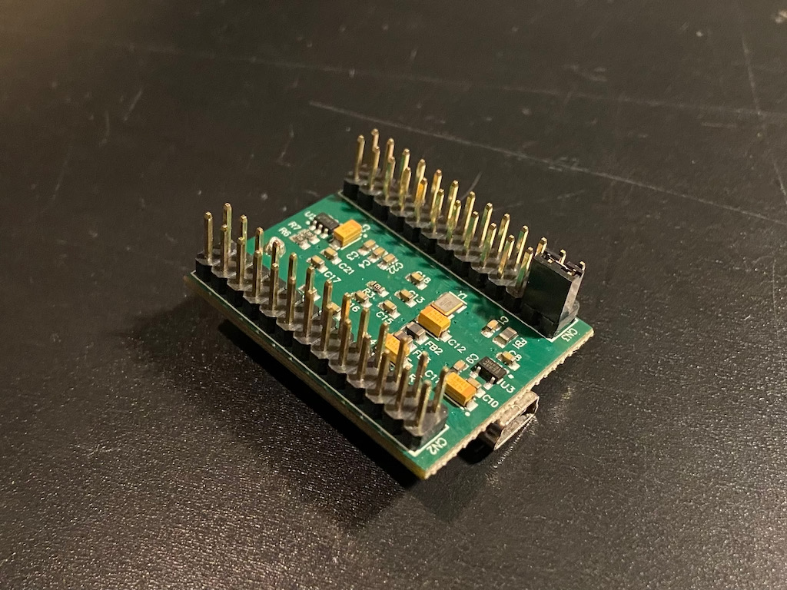

# How to reproduce

## Requirements
- balenaFin 1.1.0 or 1.1.1 (1.0.0 has not been tested)
- Quectel EC-25 cellular modem
- SIM card (I use ThingsMobile, but I expect any other to work as well)
- FTDI FT-4232H mini module
- A jumper
- Antenna for cellular modem

# Steps to reproduce

## Connect up the FTDI
The FTDI FT-4232H mini module cannot be used without any connections. At the very minimum you need to put a jumper between `Vbus` and `Vcc`:



This does not provide voltage to the IO pins, but this is not needed unless you actually want communicate with other devices.

## Prepare app
Create a balena application and push this repo to it using balena push or git push. You can also use local mode if you prefer. The default configuration works fine. You can also use this button:

[](https://dashboard.balena-cloud.com/deploy?repoUrl=https://github.com/martenjacobs/balena-fin-serial-error&defaultDeviceType=fincm3)

Download and flash the development image for `balenaOS v2.58.3+rev1` or `2.51.1+rev1`; These are the versions I've tested. I expect it to work on other versions as well.

## Connect the device
- Connect the FTDI to the Fin through USB 
- Insert the modem into the Fin's mPCIe slot and connect the antennas
- Insert the SIM card into the Fin
- Connect the Fin to the network through ethernet
- Power up the device

## Push config using configizer
- make sure you have balena CLI properly set up
- `cd` into the `configizer` folder
- create a file called `batch` containing the UUID of your device. 
  For example: 
  ```bash
  echo 71xxxxxxx2545878b5e4afab4fd0f2a5 > batch
  ```
- run the script: `./run.sh`. 
  
  It may ask for your ssh key password (if it's encrypted). This will take a few minutes with no further output, so be patient.

## Connect cellular
Set up the cellular connection, in case of Things Mobile, this is done with the following command:
```bash
nmcli c add type gsm ifname cdc-wdm0 con-name TM apn TM gsm.home-only no
```
You may need to adjust it for the SIM card you're using.

# Test 
First reboot the device

When the device is on-line again, log in to the device's host shell through SSH (or from the balena console), then run the following command:
```bash
journalctl -u ModemManager --all -f
```

After some time messages like this will start appearing:
```
Dec 14 10:28:00 71edded ModemManager[1284]: transaction 0x40 aborted, but message is not abortable
Dec 14 10:28:08 71edded ModemManager[1284]: transaction 0x10 aborted, but message is not abortable
Dec 14 10:28:08 71edded ModemManager[1284]: [modem0/bearer0] reloading stats failed: QMI operation failed: Transaction timed out
```

These errors will keep appearing every 30 seconds.

Stopping the `test-case` service will cause a load of the following type of messages to appear:
```
[/dev/cdc-wdm0] No transaction matched in received message
```

after which the modem will continue to work fine.